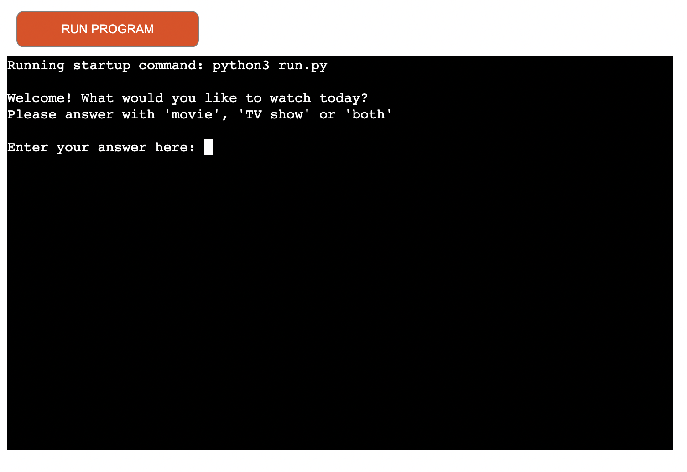
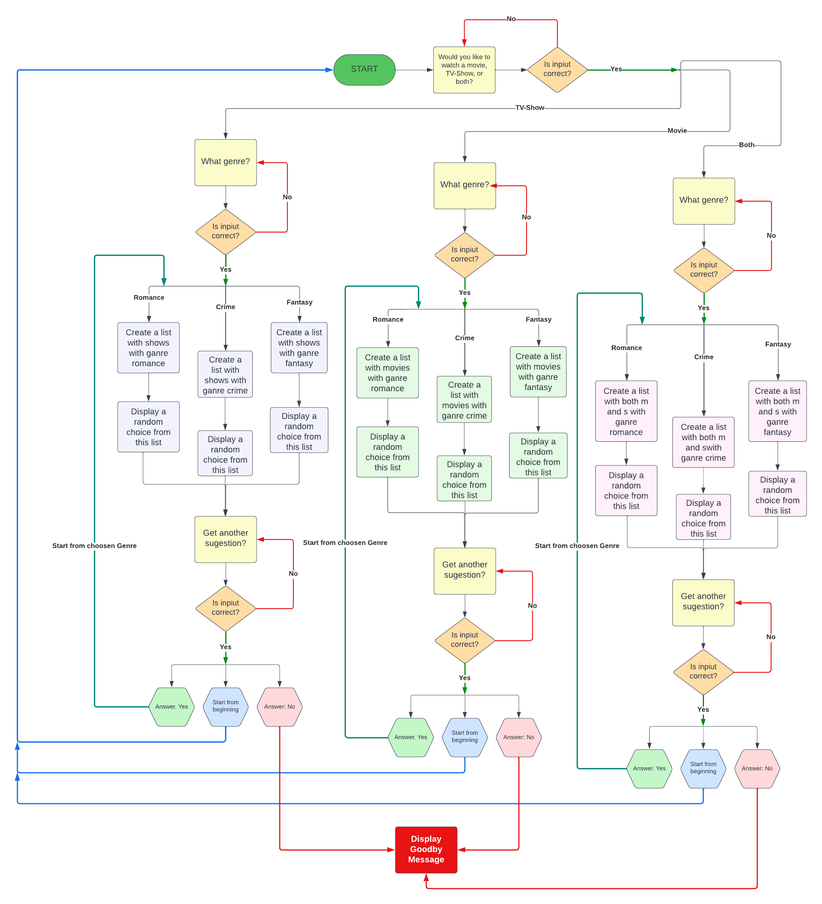
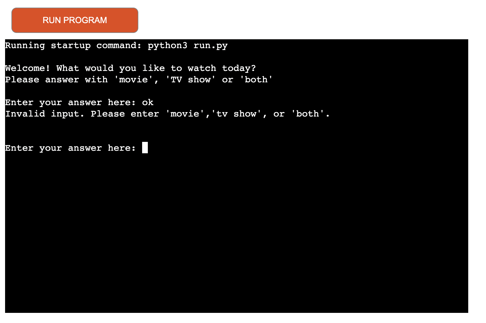
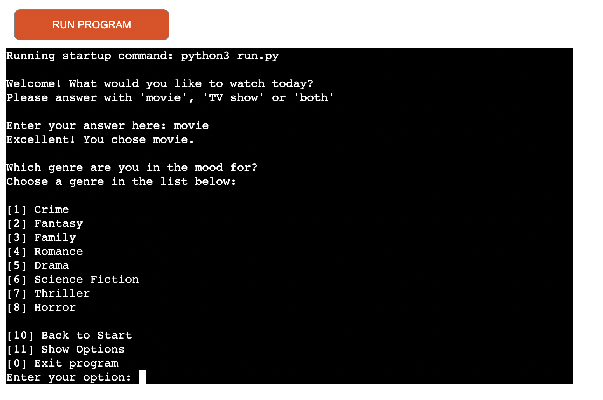
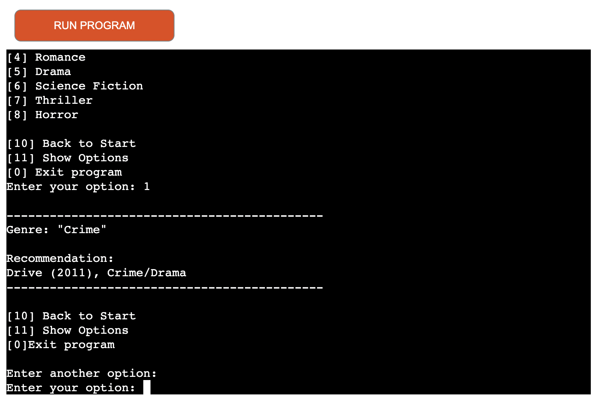
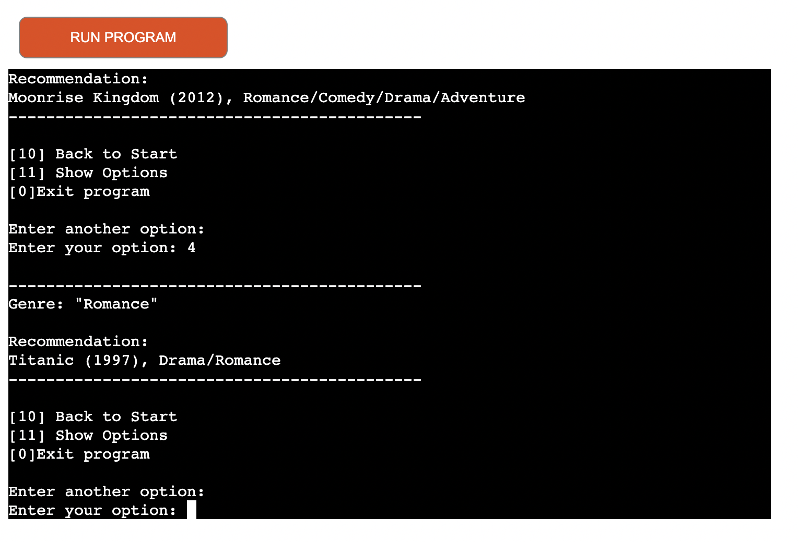
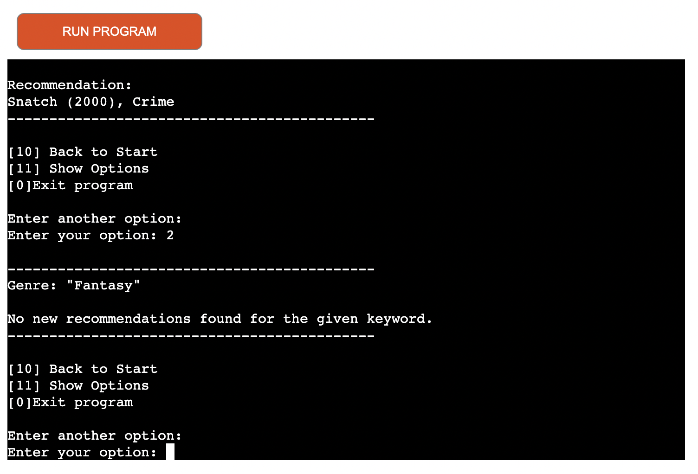
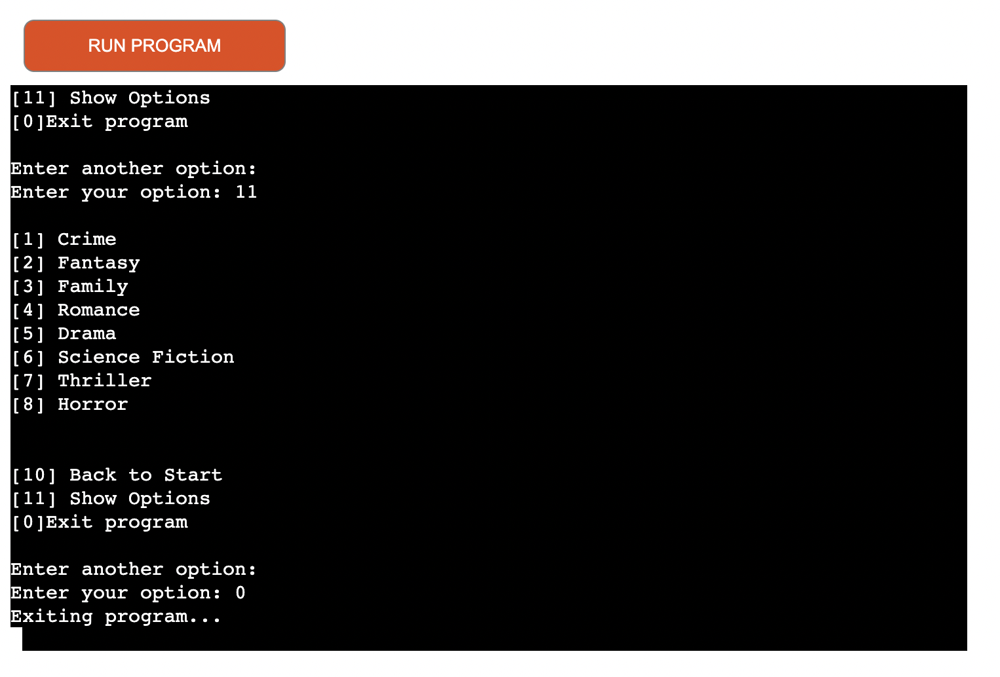
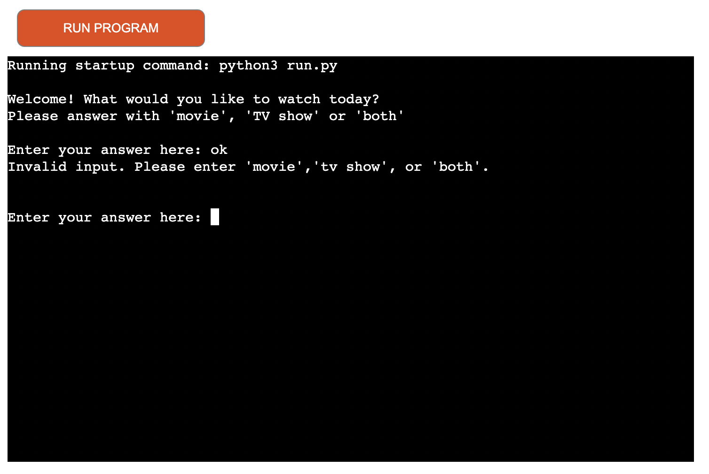
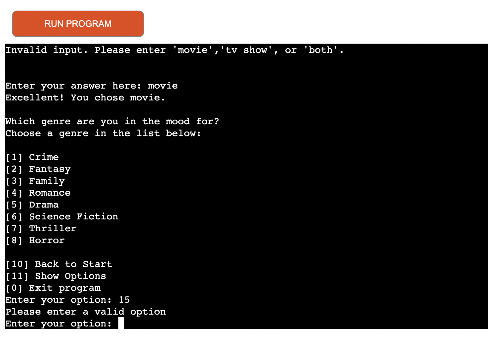

# What to Watch

This project provides a user-friendly and interactive way for users to explore and discover new movies or TV shows based on their genre preferences, leveraging data stored in a Google Sheets document for a curated selection of recommendations.

The live link can be found here - [What-to-Watch](https://what-to-watch-efku.onrender.com/)

- [What to Watch](#what-to-watch)
  * [Usage](#usage)
  * [Site Owner Goals](#site-owner-goals)
  * [User Stories](#user-stories)
    + [As a user I want to:](#as-a-user-i-want-to-)
  * [Logic Flow](#logic-flow)
  * [Feautres](#feautres)
    + [Interactive User Interface:](#interactive-user-interface-)
    + [Genre Selection Menu:](#genre-selection-menu-)
    + [Fetching Data from Google Sheets:](#fetching-data-from-google-sheets-)
    + [Recommendation Generation:](#recommendation-generation-)
    + [Random Recommendation Display:](#random-recommendation-display-)
    + [Informative Output:](#informative-output-)
    + [Looping and Navigation:](#looping-and-navigation-)
    + [Check for invalid input](#check-for-invalid-input)
    + [Future Features](#future-features)
  * [Data Model](#data-model)
    + [1. Title](#1-title)
    + [2. Genre](#2-genre)
  * [Testing](#testing)
    + [PEP8 Testing](#pep8-testing)
  * [Libraries and Technologies Used](#libraries-and-technologies-used)
    + [Python Libraries:](#python-libraries-)
    + [Programs Used](#programs-used)
  * [Known Bugs](#known-bugs)
  * [Fixed Bugs](#fixed-bugs)
    + [Troubleshooting Duplicate Recommendations](#troubleshooting-duplicate-recommendations)
    + [Troubleshooting Duplicate Recommendations](#troubleshooting-duplicate-recommendations-1)
  * [Deployment](#deployment)
    + [Cloning the Project](#cloning-the-project)
    + [Deployment on Render](#deployment-on-render)
    + [Configuration on Render](#configuration-on-render)
  * [Credits](#credits)
    + [Resources Used](#resources-used)
  * [Acknowledgments](#acknowledgments)

<small><i><a href='http://ecotrust-canada.github.io/markdown-toc/'>Table of contents generated with markdown-toc</a></i></small>

## Usage

1. Welcome Message: When you run the tool, it will display a welcome message asking you what you would like to watch today, whether it's a movie, TV show, or both.

2. Input Selection: You'll be prompted to enter your choice as 'movie', 'TV show', or 'both'.

3. Genre Selection: After selecting your preference, you'll be presented with a menu of genres to choose from. Each genre corresponds to a category like Crime, Fantasy, Family, etc.

4. Recommendation Display: Once you choose a genre, the tool will display a random recommendation from that genre. If there are no recommendations available for the selected genre, it will inform you accordingly.

5. Navigation Options: After viewing a recommendation, you'll have options to explore other genres, return to the main menu, or exit the tool.

6. Repeat: You can continue using the tool to discover new recommendations based on different genres or preferences.

## Site Owner Goals

- Provide a simple way for users to navigate the ocean of different choices of what to watch

- Empower users with a time-saving tool to make life easier by offering a convenient solution for efficient decision-making

- Enhance productivity by streamlining the entertainment selection process

- Maximize leisure time by providing valuable recommendations promptly

- Enrich the viewing experience with informed choices

## User Stories

### As a user I want to:

- Navigate through a variety of entertainment options effortlessly.

- Save time by quickly finding recommendations tailored to my preferences.

- Avoid the frustration of indecisively scrolling through streaming platforms.

- Enjoy a more enriching viewing experience with informed choices.

- Maximize my leisure time by efficiently discovering content I love.

## Logic Flow

To help plan my project i used Lucid Charts to create a Flow Chart. It's worth noting that since the flow chart was generated early in the project timeline, it may not encompass all aspects of the final tool structure.

## Feautres

### Interactive User Interface:
The script engages users with a friendly welcome message and prompts them to select their preference between watching a movie, TV show, or both. This provides an interactive experience by allowing users to indicate their preferences directly.

### Genre Selection Menu:
After the user selects their preference, they are presented with a menu of genres to choose from. This menu allows users to narrow down their preferences based on specific genres they are interested in, such as Crime, Fantasy, Family, etc.

### Fetching Data from Google Sheets: 
The script interacts with Google Sheets to retrieve data about movies and TV shows. It uses the gspread library along with Google OAuth2 authentication to access the data stored in a Google Sheets document.

### Recommendation Generation: 
Once the user selects a genre, the script searches the fetched data to find recommendations matching that genre. It filters the recommendations based on keywords related to the selected genre, such as "Crime for crime-related movies or TV shows.

### Random Recommendation Display:
After filtering the recommendations, the script randomly selects one recommendation from the filtered list using the random function from 'import random'. This randomness adds an element of surprise and discovery for the user, as they are presented with a new recommendation each time.

### Informative Output:
The script displays the randomly selected recommendation to the user, along with relevant information such as the title, genre, and possibly other details. If no recommendations are found for the selected genre, the user is informed accordingly.

### Looping and Navigation:
After displaying a recommendation, the user has the option to get another recommendation, explore other genres, go back to the main menu, or exit the program. This looping and navigation mechanism allows users to continue exploring recommendations or exit the program when they are done.

### Check for invalid input
Ensure that all input provided by the user is valid. If the input does not match the expected format or range, prompt the user to try again. This applies to options such as "movie," "tv-show," or "both," as well as numerical inputs for genres and navigation menu selections.

### Future Features

On the horizon is the implementation of web scraping functionality, which will enable the inclusion of diverse content sources like IMDB's top 250 movies and top 250 TV shows. This enhancement will introduce the option for users to explore random selections from these renowned lists effortlessly.

## Data Model

The data model for the **What to Watch** project is minimalistic and designed to accommodate the core information necessary for providing recommendations to users. It consists of two primary attributes:

### 1. Title
Description: Represents the title of the movie or TV show.
Type: String

### 2. Genre
Description: Represents the genre of the movie or TV show.
Type: String

This simple data model allows for easy organization and retrieval of movie and TV show data based on titles and genres. It forms the backbone of the recommendation system, enabling users to discover content tailored to their genre preferences.

## Testing

### PEP8 Testing
The python files have all been passed through [PEP8](https://pep8ci.herokuapp.com/#) without any errors.

| Feature | Expected Outcome | Testing Performed | Result | Pass/Fail |
| --- | --- | --- | --- | --- |
| Starting Program | Display welcome message and allow for user input| Starting the program | A welcome message is displayed and allows for user input | Pass |
| Validate correct user input in `what_to_watch` function | If correct value move to `genre_menu` function that displays correct type of 'movie', 'tv show' or 'both' | Input 'movie', 'tv show', or 'both' | User feedback of choice is displayed and genre menu is showing | Pass |
| Validate incorrect user input in `what_to_watch` function | If incorrect value prompt user to try again| Input invalid option | Displays a message prompting user to try again | Pass |
| Selecting a genre | Display recommendations based on selected genre | Choosing a genre from the menu | Recommendations related to the selected genre are displayed | Pass |
| List of genre | When no more new recommendations in list: display message to user | Choosing the same genre to display all the recommendations in the list | When all recommendations have been displayd a message is shown to the user | Pass |
| Returning to start menu | Allow user to return to the main menu from genre menu | Selecting 'Back to Start' option | Program returns to the main menu | Pass |
| Show option | When "11" is pressed the option menu will show | Entering "11" | the option menu is shown | Pass |
| Exiting program | Allow user to exit the program gracefully | Selecting 'Exit program' option | Program exits | Pass |
| Validating user input in genre menu | Ensure user input for genre selection is validated | Entering invalid options | Program prompts user to enter a valid option until valid input is provided | Pass |

## Libraries and Technologies Used

### Python Libraries:

- [random](https://docs.python.org/3/library/random.html?highlight=random#module-random) - `random.choice` is used to select a randome movie or tv show to be displayed as a recommendation.
- [gspread](https://pypi.org/project/gspread/): to allow communication with Google Sheets.
- [google.oauth2.service_account](https://google-auth.readthedocs.io/en/stable/index.html):  used to validate credentials and grant access to google service accounts.

### Programs Used

- [GitHub](https://github.com/) - Used for version control and documentation.
- [Render](http://https://render.com/) -  Used to deploy the live project.
- [Lucidchart](https://lucid.app/documents#/dashboard) -  used to create the game flowchart
- [PEP8](https://pep8ci.herokuapp.com/#) - Ensured adherence to Python code standards and maintained code quality.
- [GitPod](gitpod.io) - Served as the workspace for development, providing an integrated environment for coding and testing.
- [ChatGPT](https://chat.openai.com/) - Leveraged for troubleshooting, receiving movie and TV show recommendations, and ensuring grammar and spelling accuracy throughout the project.

## Known Bugs

No known bugs.

## Fixed Bugs

### Troubleshooting Duplicate Recommendations

**Issue**: Duplicate recommendations were appearing in the output.

### Troubleshooting Duplicate Recommendations

**Investigation**: I identified that the `find_suggestion_by_keyword` function didn't prevent duplicates. Since the function was called each time a key value was pressed as the user's choice, this made it troublesome since nothing seemed to work that was applied in the `find_suggestion_by_keyword` function.

**Solution**: A `displayed_suggestions` set was introduced to track displayed recommendations. The function was modified to check this set before adding suggestions to `found_list`. The displayed `displayed_suggestions` set was integrated into the `genre_menu` function to override the problem of the `find_suggestion_by_keyword` function being restarted.

**Testing and Refinement**: Iteratively tested and refined the solution.

**Verification**: Confirmed the fix prevented duplicate recommendations.

## Deployment

The live link can be found here: [What-to-Watch](https://what-to-watch-efku.onrender.com/)

### Cloning the Project
1. Clone this project from [GitHub](https://github.com/elindalenback/what-to-watch).

### Deployment on Render
2. Log in to [Render](https://render.com/) or create an account.

3. On the dashboard, select "*NEW*" and then choose "*Create a new Web Service*".

4. Opt for "*Build and deploy from a Git repository*" to connect to the GitHub repository.

5. Under "*Connect a repository*", paste your GitHub repository link into the search bar.

### Configuration on Render
6. Select a name for your project, choose the closest region from the list, set "*Runtime*" to "Python," and set the "*Build Command*" to "$pip install -r requirements.txt". In the "*Start Command*", copy and paste the content of the Procfile, which in this case is "web: node index.js".

- **IMPORTANT:** Remember to add your "creds.json" file in the "*Environment Variables*" to ensure access to your Google Spreadsheet.

7. Click "*Create Webservice*" and wait for the program to be deployed.

8. Your page's link will be available in the top-left corner of the loading page.

**The site is now live and operational.**

## Credits 
### Resources Used
- [W3Schools](https://www.w3schools.com/)  
- [Stack Overflow](https://stackoverflow.com/)
- I followed the steps in the Code Institute Python walkthrough project - Love Sandwiches when setting up my Google Sheets API.

## Acknowledgments
I'm grateful for the Code Institute's Student Care Team for their prompt responses and valuable feedback and understanding, which have been instrumental in my learning journey. I also want to thank the Tutors at Code Institute for helping me deploy this project, it was a long way but we made it!

And finally big thank you to my fellow student Anton Eriksson for all the brainstorming and troubleshooting. 